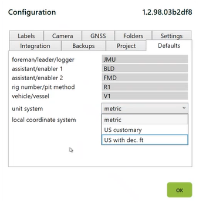

# Form defaults

The **Defaults** tab in Configuration sets values that automatically populate every new form you create in the current project. This saves repeated data entry, reduces errors, and keeps values consistent across a project's forms.

## What you can default

| Field | Description |
|---|---|
| **Foreman / Leader / Logger** | Name of the person supervising or logging the drilling. |
| **Assistant / Enabler 1 & 2** | Names of assistants involved in the drilling process. |
| **Rig Number / Pit Method** | Identifier for the drilling rig or pit method used. |
| **Vehicle / Vessel** | Name or ID of the vehicle or vessel associated with the project. |
| **Unit System** | Choose from **Metric**, **US Customary**, or **US with Decimal Feet**. |
| **Local Coordinate System** | EPSG code for your project's coordinate reference system. See [GPS & coordinates](gps-and-coordinates.md). |

<figure><figcaption></figcaption></figure>


**Tip:** Setting these defaults ensures that new forms are pre-filled with standard values, reducing manual input and minimising errors.


## Defaults apply to new forms only

Changing a default does not retroactively update forms you've already created — the change only affects forms created from that point forward. If you need to update existing forms, you'll have to edit them individually.

## When to use defaults

* **Multi-day projects** — set the drilling crew names once instead of typing them on every form.
* **Single-rig projects** — default the rig identifier and override manually for the occasional exception.
* **Consistent units** — set the unit system once so no form is logged in the wrong units by accident.

## Related settings

Some Onsite-wide settings live outside the Defaults tab but complement it:

* **Label printer** — set in [Label printing](label-printing.md), applies across projects
* **Camera source** — set in [Camera](camera.md), applies across projects
* **GPS source** — set in [GPS & coordinates](gps-and-coordinates.md), applies across projects
* **UI language** — set in Configuration → Language & UI

***

**See also**

* [Project setup](project-setup.md) — the project metadata these defaults live under
* [GPS & coordinates](gps-and-coordinates.md) — GPS source and coordinate system
